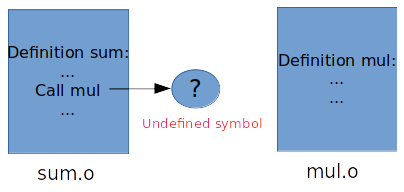
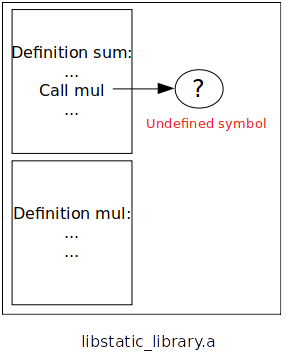
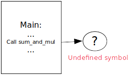

# Libraries loading

This is a short personal memo about static/shared libraries loading process.

## Table of content

- [Static libraries](#static-libraries)
    * [Write C code](#write-c-code)
    * [Generate object files](#generate-object-files)
    * [Generate archive file](#generate-archive-file)
    * [Write C program](#write-c-program)
    * [Compile C program](#compile-c-program)

## Static libraries

Static libraries on Linux have the `.a` extension (for `archive`).
This section goes througout the static library creation process in details.

### Write C code

First, let's write some C code for our library. Our library is divided into four files:
 * `sum.c` and `sum.h` that contains a sum function definition and declaration,
 * `mul.c` and `mul.h` that contains a multiplication function definition and declaration

```c
/* sum.c */

#include "sum.h"

#include "mul.h" // declaration required as mul() is used below

int sum_and_mul(int first, int second) {
    return first + mul(first, second);
}
```

```c
/* mul.c */

#include "mul.h"

int mul(int first, int second) {
    return first * second;
}
```

```c
/* sum.h */

int sum_and_mul(int first, int second);
```

```c
/* mul.h */

int mul(int first, int second);
```

### Generate object files

Object files are `compiled` files but not `linked` files.
That means `symbols` are `not resolved` from one object to another.

For example, two object files are generated for the two sources files `sum.c` and `mul.c`:
 * `mul.o` has no symbols to other objects, so it has no unresolved symbols,
 * `sum.o` has the symbol `mul` that is defined into the `mul.o` object, this symbol is unresolved

This is fine for now, the files are supposed to be grouped together later.

The two generated object files can be represented as follow:



The files are generated through the following command:

```sh
gcc -c mul.c -o mul.o
gcc -c sum.c -o sum.o
```

### Generate archive file

The archive file `.a` is a group of `object` files, all together.



The archive file is generated through the `ar` command:

```sh
ar rvs libstatic_library.a sum.o mul.o
```

The `rvs` option stand for: replacement, verbosity and add new "objects" (indices) to the archive,
replace them if necessary.

Note that no linking is done here. The unresolved symbols remain unresolved after the archive creation, even if the two concerned objects are part of the archive.

### Write C program

We can know write a simple C program that uses the library:

```c
#include "sum.h"

#include <stdio.h>

int main()
{
    int value = sum_and_mul(1000, 2000);

    printf("%d", value);

    return 0;
}
```

### Compile C program

We can now simply compile the program (without linking):

```sh
gcc -S -I static_library executable/main.c -o assembly_code
```

Details for the command above:
* `S` is the option to generate an assembly code output, not a binary one,
* `I` is the path of the custom headers (we need the declaration of `sum_and_value` to be visible for the compiler),

The output assembly is now in `assembly_code`.

A few lines contain:

```asm
movl	$2000, %esi
movl	$1000, %edi
call	sum_and_mul@PLT
```

This is the call to the library function `sum_and_mul`.
As we can see, the `sum_and_mul` content is not part of the compiled code for now,
even if we would have fully compiled the program to binary format.

Let's compile into binary:

```sh
gcc -I static_library executable/main.c -o output
```

The following error appears:

```
/tmp/cc4TOaG2.o: In function `main':
main.c:(.text+0x13): undefined reference to `sum_and_mul'
collect2: error: ld returned 1 exit status
```

In fact, `ld`, that is called by `gcc` after the compilation, cannot find where is defined the symbol `sum_and_mul`:
as a complete part of the program cannot be found, the final output cannot be generated.

This is also possible to cancel the linking attempt (using the GCC `c` option):

```sh
gcc -c -I static_library executable/main.c -o output
```

In that case, `output` is not the final executable but an `object` file, as we generated previously when compiling the library.
The symbols are still unresolved.


