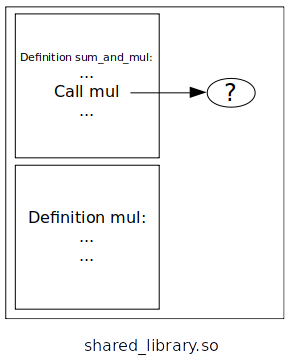

# Libraries loading

This is a short personal memo about static/shared libraries loading process.

## Table of content

- [Example C program](#example-c-program)
    * [Write library C code](#write-c-code)
    * [Generate object files](#generate-object-files)
    * [Write C program](#write-c-program)
    * [Compile C program](#compile-c-program)
- [Static libraries](#static-libraries)
    * [Generate archive file](#generate-archive-file)
    * [Link the program with the library](#link-the-program-with-the-library)
- [Shared library](#shared-library)
    * [Generate a shared library file](#generate-a-shared-library-file)
    * [Link the program with the library](#link-the-program-with-the-library)
- [Shared library symbols resolution](#shared-library-symbols-resolution)
    * [Load time relocation](#load-time-relocation)
    * [PIC Position Idependant Code](#pic-position-independant-code)

## Example C program

### Write library C code

First, let's write some C code for our library. Our library is divided into four files:
 * `sum.c` and `sum.h` that contains a sum function definition and declaration,
 * `mul.c` and `mul.h` that contains a multiplication function definition and declaration

```c
/* sum.c */

#include "sum.h"

#include "mul.h" // declaration required as mul() is used below

int sum_and_mul(int first, int second) {
    return first + mul(first, second);
}
```

```c
/* mul.c */

#include "mul.h"

int mul(int first, int second) {
    return first * second;
}
```

```c
/* sum.h */

int sum_and_mul(int first, int second);
```

```c
/* mul.h */

int mul(int first, int second);
```

### Generate object files

Object files are `compiled` files but not `linked` files.
That means `symbols` are `not resolved` from one object to another.

For example, two object files are generated for the two sources files `sum.c` and `mul.c`:
 * `mul.o` has no symbols to other objects, so it has no unresolved symbols,
 * `sum.o` has the symbol `mul` that is defined into the `mul.o` object, this symbol is unresolved

This is fine for now, the files are supposed to be grouped together later.

The two generated object files can be represented as follow:


The files are generated through the following command:

```sh
gcc -c mul.c -o mul.o
gcc -c sum.c -o sum.o
```

### Write C program

We can now write a simple C program that uses the library:

```c
#include "sum.h"

#include <stdio.h>

int main()
{
    int value = sum_and_mul(1000, 2000);

    printf("%d", value);

    return 0;
}
```

### Compile C program

We can now simply compile the program (without linking):

```sh
gcc -S -I static_library executable/main.c -o assembly_code
```

Details for the command above:
* `S` is the option to generate an assembly code output, not a binary one,
* `I` is the path of the custom headers (we need the declaration of `sum_and_value` to be visible for the compiler),

The output assembly is now in `assembly_code`.

A few lines contain:

```asm
movl	$2000, %esi
movl	$1000, %edi
call	sum_and_mul@PLT
```

This is the call to the library function `sum_and_mul`.
As we can see, the `sum_and_mul` content is not part of the compiled code for now,
even if we would have fully compiled the program to binary format.

Let's compile into binary:

```sh
gcc -I static_library executable/main.c -o output
```

The following error appears:

```
/tmp/cc4TOaG2.o: In function `main':
main.c:(.text+0x13): undefined reference to `sum_and_mul'
collect2: error: ld returned 1 exit status
```

In fact, `ld`, that is called by `gcc` after the compilation, cannot find where is defined the symbol `sum_and_mul`:
as a complete part of the program cannot be found, the final output cannot be generated.

This is also possible to cancel the linking attempt (using the GCC `c` option):

```sh
gcc -c -I static_library executable/main.c -o output
```

In that case, `output` is not the final executable but an `object` file, as we generated previously when compiling the library.
The symbols are still unresolved.


## Static libraries

Static libraries on Linux have the `.a` extension (for `archive`).
This section goes througout the static library creation process in details.

### Generate an archive file

The archive file `.a` is a group of `object` files, all together.


The archive file is generated through the `ar` command:

```sh
ar rvs libstatic_library.a sum.o mul.o
```

The `rvs` option stand for: replacement, verbosity and add new "objects" (indices) to the archive,
replace them if necessary.

Note that no linking is done here. The unresolved symbols remain unresolved after the archive creation, even if the two concerned objects are part of the archive.

### Link the program with the library

The last step is now to take the `sum_and_mul` content, and move it into the final program.
This action can be performed by linking the program with the library.

```sh
gcc -c -I static_library executable/main.c -o output -Lstatic_library/ -lstatic_library
```

First, the content and of the `sum_and_mul` function is copied from the library to the final binary.


As the `mul` symbol is not resolved as well from the program point of view,
then the definition of the `mul` function is moved to the program as well.


As the library content is now part of the final program, this program can be executed without the library.
If the library is modified and if the modifications have to be applied to the program,
then the program must be compiled again.

## Shared library

The shared library is a `.so` file. It is loaded dynamically at runtime of a program.
The program uses functions and structures that are part of the dynamic library.

### Generate a shared library file

It is now possible to group all the object files of the library into a `.so` file
that will be the shared library file.

```sh
gcc -shared -o libshared_library.so shared_library/mul.o shared_library/sum.o
```

As the static library, there is no linking of the library symbols at this moment.
The resulted shared library file can be represented as follow:



### Link the program with the library

Instead of static libraries, there is no copy of code from the library to the executable when linking a shared library.
The only thing that happens is a check that all the functions of the executable exists into the given shared library,
and that the shared library itself exists.

The executable knows now that the shared library has to be loaded before loading the executable itself (at runtime).
This data is stored into the executable (ELF format).

```sh
gcc -Ishared_library executable/main.c -o output -L. -lshared_library
```

What happened with this command can be represented as follow:


This is possible to check what shared libraries have to be loaded for the executable using `ldd`:

```sh
> ldd output

linux-vdso.so.1 (0x00007fffa53c9000)
libshared_library.so => not found
libc.so.6 => /usr/lib/libc.so.6 (0x00007f1a038c9000)
/lib64/ld-linux-x86-64.so.2 => /usr/lib64/ld-linux-x86-64.so.2 (0x00007f1a03e82000)
```

## Shared library symbols resolution

When a static library is linked with an executable, each symbol (function or data),
is resolved and replace by a memory address (this address is an "offset" from the real
address where the program will be loaded when executed).

In other words, a final executable (with static library only) or without library at all looks like:


*NOTE*: the process is really more complex than the schema above, but this is the general idea.

Doing this with shared libraries is not possible. In fact, there is no way to know in advance
where a shared library will be loaded when requesting a program to be executed.

### Load time relocation

Using `load time relocation` requires not to use `-fPIC` option when creating object files from the library sources.
This flag is used for Position-Independant Code, that is another solution for symbols resolution.

When compiling the library into `.so` final file, symbols are not resolved
and the relocations entries of the file now contains all the symbols that
will have to be resolved at running time.


*NOTE*: compiling a program with one version of the library and executing the program with a different version of this library (example: differences between objects/functions names) causes the symbols lookup process to fail when the program is started.

Once the program is loaded and the library is loaded as well, the resolution with the correct addresses into memory can take place.
The "reallocation" of the symbol occurs and the program (in memory) now have all its symbols resolved:


This method has three main limitations:
 * it takes time to relocate every unresolved symbol of the shared library when using it,
 * the "shared library" is not shared between processes, and can't be anyway, as the relocation process requires that the library is only used with the current started process,
 * the shared library code, when loaded into memory, has to be writable to perform relocation (security issue)
(solution to these problem is Position-Independant Code)

### PIC Position Independant Code

Position-Independant Code is another solution for shared library loading.
In that case, positions of symbols (functions, variables...) is independant,
no matter what program loads it, so there is no load-time relocation required.

The position of each item is calculated according offsets and positions of other items into the library.

#### Data

During the linking process, there is absolutely no way to know in advance the address of the used data (variable). This will be decided when starting the process. This is the same problem as before.

Without PIC, a null (0x0) address is set and will be replaced when the program starts and when the library is loaded for the program.

Using a PIC shared library is different: the library is loaded only once for all the programs that use it. The library is "shared" between programs and is not loaded only for one process but for all.

As before, there is no way to determine the address of the variable:


At the code position where the variable is used, some code is added to perform the following operations:
 * get the current IP value: get the `instruction pointer` by pushing its value on the stack and getting it just after, this is possible by using the following assembly code (added automatically):

```asm
mov ax, value
call next
next:
pop bx // bx now contains IP value
```

 * find the GOT (Global Offset Table) position using code added during the linking process (the GOT position of the library is known during the linking process),
 * find the variable position and read it

The final generated code is:


At execution, the following happens:


